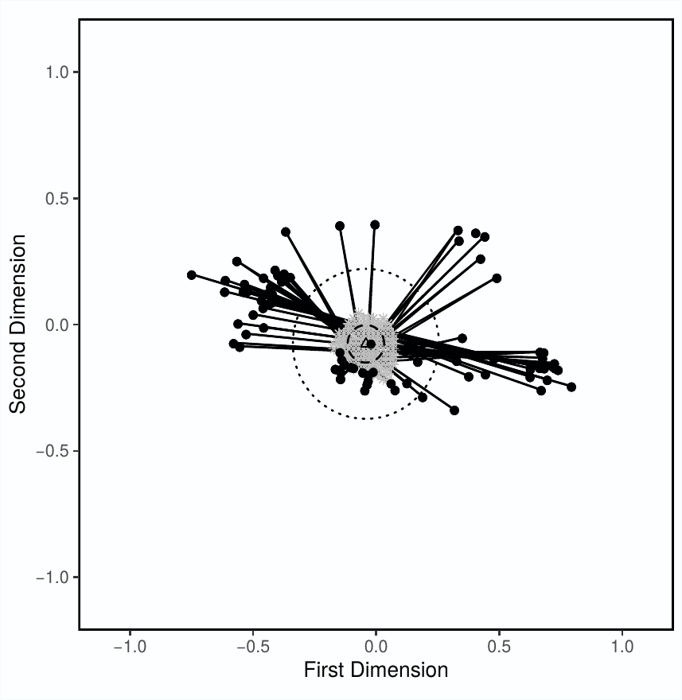

# uset

## How to install

In order to install the latest version of the `uset` package first you have to install the remotes
package. Assuming you do not already have it, the full process to install `uset` would be:

`install.packages("remotes")`

`library(remotes)`

`install_github("acarrizosa/uset")`

The final step before you can actually use the package would be to install the dependencies.  The uset 
function depends on several packages so be sure to install the following packages as well:

`install.packages(c("foreach", "parallel", "doParallel", "ggplot2", "MASS", "stringr", "devtools"))`

once all these packages are installed you are ready to use the uset package.

## Run time Disclaimer

Warning: This function can take a long time to run even if specified correctly, but especially if specified incorrectly.  Please read through the options available to minimize run time as much as possible.

## How to use the package

First load it into R by using the function:

`library(uset)`

### Input data

The input data for the uset() function needs to fulfill two requirements.  First, it must be a data.frame object.  Second, the first two columns must be named "x" and "y".  The data.frame may have more columns after these two first columns, that can include as much identifying data for the legislators as one may wish, but the first two columns must have this form.  An example of acceptable data looks like this:

`data(pydat)`

`head(pydat)`

           x          y          party
        1  0.4775935 -0.13276186 moderate
        2  0.4422785 -0.19456384  radical
        3 -0.0136173 -0.18521028 moderate
        4  0.6236023 -0.20538131  radical
        5  0.3483526 -0.05086354  radical
        6 -0.1486858 -0.10780617  radical

### Function arguments

Several arguments can be passed on to the uset function.  These are all the options available:

`args(uset)`

        function(dat, uset.coarse = TRUE, uset.fine = FALSE, uint.coarse = 0.1, 
                uint.fine = 0.02, threshold = 0.5, yolk = FALSE, yolkint.coarse = 0.05, 
                yolkint.fine = 0.01, points.on.line = 1000, plotuset = TRUE, 
                clusters = "default")

`dat` is simply the inputed data that must be in the format specified above.

`uset.coarse` is TRUE if one would like to carry out the estimation of the coarse uset.  If FALSE, the function will either immediately carry out the `uset.fine` search, or it will immediately search for the yolk.  I do not recommed `uset.coarse` to ever be FALSE because it can make the calculation time a lot longer.

`uset.fine` asks whether the fine search for the uncovered set should be carried out.

`uint.coarse` specifies the interval of the coarse gridsearch.  By default this coarse grid interval is of .1

`uint.fine` this creates the interval for the fine search.  By default the fine grid interval is of .02

`threshold` specifies the threshold necessary for a bill to pass.  By default the threshold is set at .5 assuming that bills have an absolute majority threshold.  The threshold must be surpassed, and not simply met so that the function actually captures the 50%+1 votes necessary to pass a bill.  That being said, higher thresholds can also be considered such as 3/5 or 2/3 by modifying this argument.  With higher threhsolds the uncovered set may coincide with the core, should a core exist.

`yolk` if TRUE the function also searches for the yolk.  By default it is set to FALSE.

`yolkint.coarse` sets the interval for the coarse grid used to search for the yolk.

`yolkint.fine` sets the interval for the fine grid used to search for the yolk.

`points.on.line` to search for the yolk median lines have to be calculated, and distances have to be taken from chosen yolk candidates to each of these median lines.  This option specifies how many points to place on each median line to take the distances of these points to each yolk point candidate.  The chosen yolk center becomes the point that can minimize the distance from the furthest of these median lines.  This is equivalent to saying the center of the yolk creates the smallest circle possible that minimizes the distance from all median lines.  By default 1,000 points are placed on each median line.  Smaller numbers may be chosen to make estimation faster, but I have found 1,000 to be the best option for most purposes.  Making the number larger makes estimation time a lot longer, and making the number smaller can lead to non-intuitive yolk centers being chosen.

`plotuset` specifies whether the `uset` function should return a plot or not.  If TRUE, `uset` returns a ggplot object plotting ideal points, median lines, the uncovered set, the yolk, and the 4r circle, depending on which of these were requested from the `uset` function in previous arguments.

`clusters` determines the number of cores to use for estimation.  This can be specified as either "default", or "optimal", or it can be assigned a numeric value. "default" runs the function using a single core.  "optimal" takes the number of cores of your computer, minus one, and assigns it to the cluseters variable.  Finally, one may also assign a number to this option, such as `clusters=5`.  If a number is chosen, the number must be smaller than the total number of cores of the computer trying to run the function.  Otherwise the function stops and returns an error.

### Output

`dat` the function stores and returns the data you provided it.

`yolkcenter` this gives the location of the center of the yolk as "x" and "y" coordinates

`yolkradius` this gives the radius of the yolk

`yolkdiameter` this gives the diameter of the yolk

`medianlines` this provides all the median lines.  These lines are provided as slopes (b) and intercepts (m), but they are also provided as connection between points--(x1,y1) to (x2,y2)

`uset` This provides all the points that were found to be part of the uncovered set.

To illustrate what an output looks like I have already run uset on the data and I have stored the output.  You can see what the function stores with:

`data(output)`

`sapply(output, head)`

        $dat
                      x           y legis partidoPolitico         nombres         apellidos idParlamentario
        1495  0.4775935 -0.13276186   105             ANR  Mario Walberto Soto Estigarribia          100562
        1496  0.4422785 -0.19456384   106             ANR       Juan Jose   Vazquez Vazquez          100542
        1497 -0.0136173 -0.18521028   113             ANR Mirian Graciela         Alfonso G          100426
        1498  0.6236023 -0.20538131   115             ANR         Alfonso    Gonzalez Nunez          100554
        1499  0.3483526 -0.05086354   116             ANR   Carlos Manuel       Maggi Rolon          100560
        1500 -0.1486858 -0.10780617   118             ANR    Carmelo Juan   Benitez Cantero          100516
        
        $yolkcenter
                  x           y 
        -0.04168538 -0.07609142 
        
        $yolkradius
        [1] 0.07420572
        
        $yolkdiameter
        [1] 0.1484114
        
        $medianlines
                     m           b        x1         x2         y1          y2
        8  -0.09636655 -0.08673782 0.4775935 -0.5304037 -0.1327619 -0.03562465
        9  -0.05748602 -0.10530691 0.4775935 -0.5812212 -0.1327619 -0.07189482
        20 -0.04560019 -0.11098351 0.4775935 -0.5561212 -0.1327619 -0.08562428
        35 -0.07886244 -0.09509767 0.4775935  0.7225482 -0.1327619 -0.15207958
        37 -0.16462262 -0.05413916 0.4775935  0.6262506 -0.1327619 -0.15723418
        42 -0.24174186 -0.01730751 0.4775935 -0.6175067 -0.1327619  0.13196972
        
        $uset
                       x          y
        361  0.028314619 -0.2160914
        362  0.048314619 -0.2160914
        390 -0.011685381 -0.1960914
        391  0.008314619 -0.1960914
        392  0.028314619 -0.1960914
        393  0.048314619 -0.1960914
        
If the `plotuset` option is set to TRUE, the function also stores this ggplot object as the seventh item in the list.

### Trial Run

This is an example of how to run a very short search for the uncovered set.  Runtime for this should be around 5-10 minutes in a normal laptop computer.  

        output2<-uset(pydat,
                uint.coarse=.1,
                yolk=T,
                yolkint.coarse=.1,
                yolkint.fine=0.05,
                plotuset=T,
                points.on.line = 1000,
                clusters="optimal")
                
        output2
                
Note that although this example does not provide a good estimate of the uncovered set it *can* quickly provide an adequate estimate of the yolk if we set yolkint.fine to 0.01.  That is, if the exact shape of the uncovered set is not of interest, it may be more efficient to only estimate the yolk, which can be found pretty quicly.  It is always quicker to include a coarse search for the uncovered set though, because it can point the function to a narrower search area for the uncovered set.  

